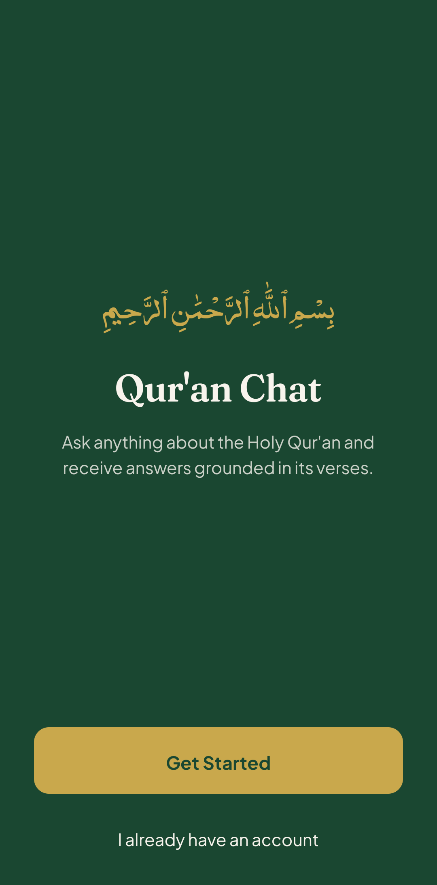
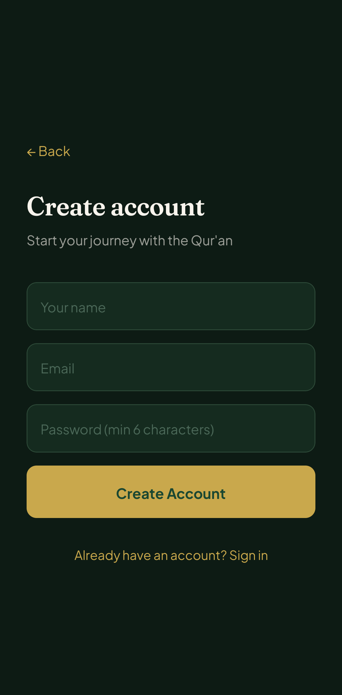
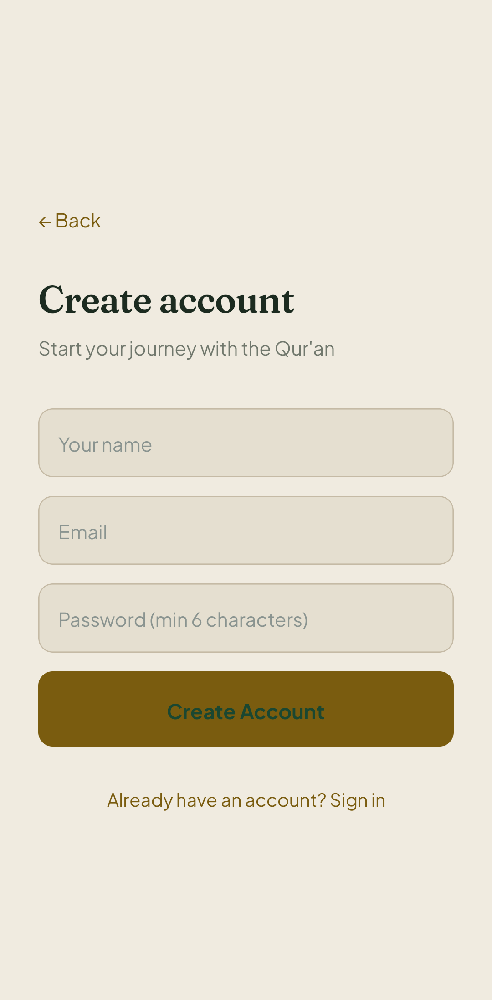
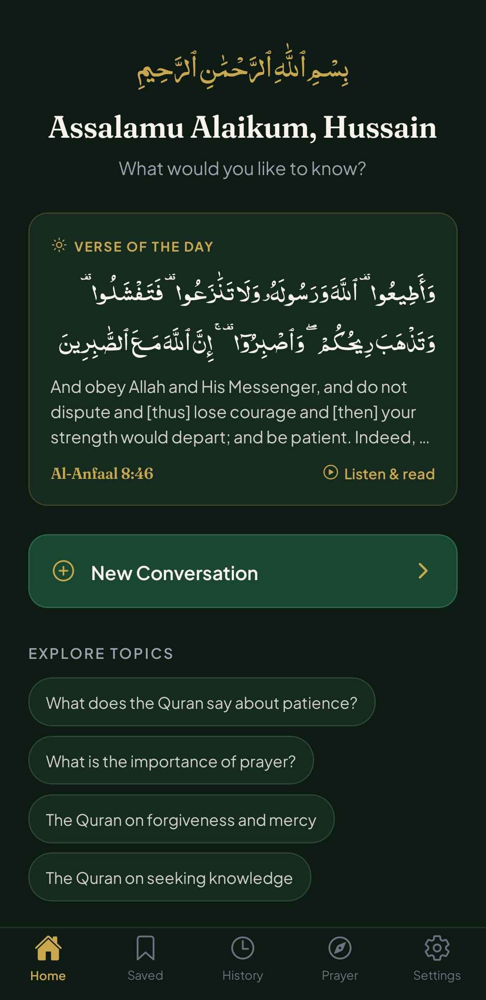
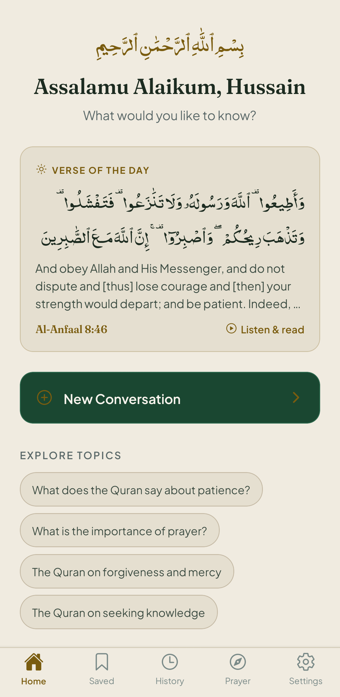
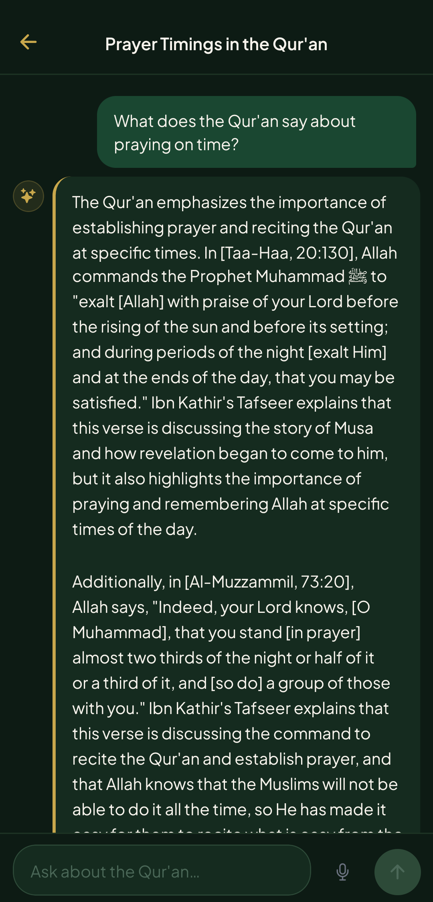
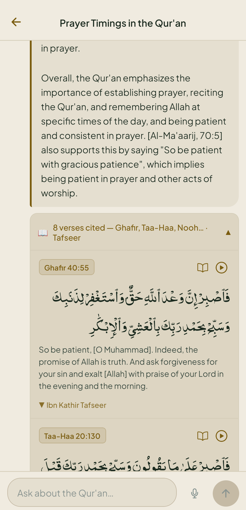
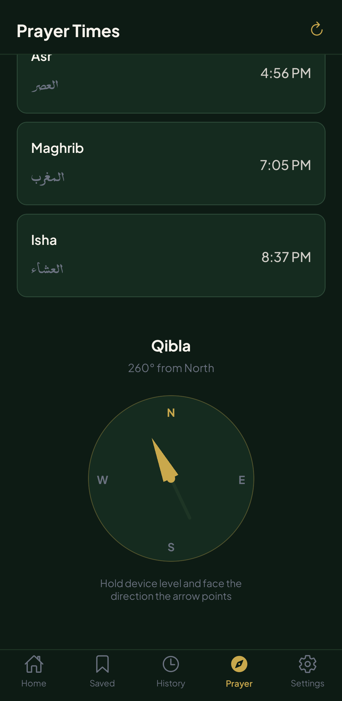
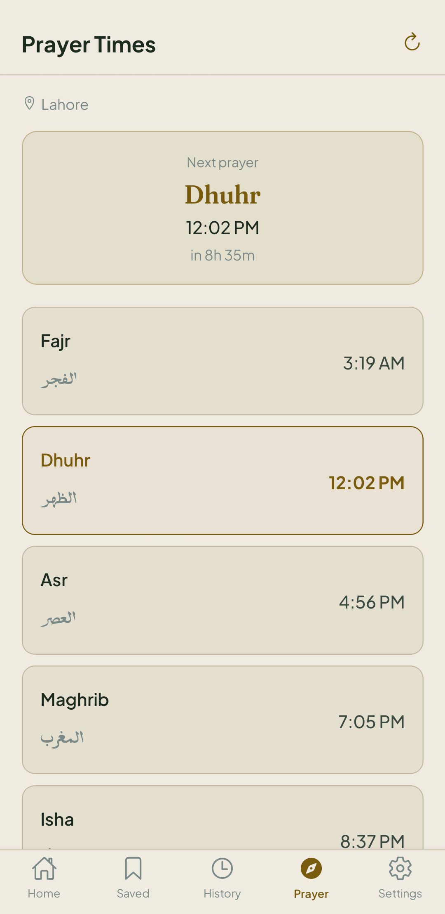

# Qur'an Chat

An AI-powered conversational app grounded entirely in Qur'anic verses. Every answer is backed by real citations retrieved via semantic search, with no hallucinated content.

<p align="center">
  
</p>

<div align="center">
<table>
  <tr>
    <td align="center"><b>Welcome (Dark)</b></td>
    <td align="center"><b>Welcome (Light)</b></td>
  </tr>
  <tr>
    <td></td>
    <td></td>
  </tr>
</table>
</div>


<div align="center">
<table>
  <tr>
    <td align="center"><b>Home (Dark)</b></td>
    <td align="center"><b>Home (Light)</b></td>
  </tr>
  <tr>
    <td></td>
    <td></td>
  </tr>
</table>
</div>

<div align="center">
<table>
  <tr>
    <td align="center"><b>Chat (Dark)</b></td>
    <td align="center"><b>Chat (Light)</b></td>
  </tr>
  <tr>
    <td></td>
    <td></td>
  </tr>
</table>
</div>

<div align="center">
<table>
  <tr>
    <td align="center"><b>Prayer (Dark)</b></td>
    <td align="center"><b>Prayer (Light)</b></td>
  </tr>
  <tr>
    <td></td>
    <td></td>
  </tr>
</table>
</div>


## Features

### AI and retrieval
- **Verse-grounded answers**: every reply cites the exact Qur'anic verses used to generate it; the model is forbidden from adding anything outside those verses
- **Streaming answers**: responses stream token-by-token from Groq's LLaMA 70B over a Vercel Edge runtime, so the first words appear in under a second
- **Ibn Kathir tafseer**: cited verses include collapsible Ibn Kathir commentary, and the model weaves that commentary into its explanation so it teaches the verse rather than only quoting it
- **Query understanding**: each question is rewritten by a fast 8B model into a focused English search query, translating names (Musa to Moses, Isa to Jesus) and stripping honorifics before the vector search runs
- **Semantic search**: questions are matched by meaning, not keywords, using 768-dim Jina embeddings over all 6,236 verses stored in Supabase pgvector
- **Exact verse lookup**: type a reference like 2:255 or a name like Ayat al-Kursi and the app pins that verse at the top of the context before running the semantic search
- **Low-confidence guard**: when the top match scores below 0.65 similarity the app returns "consult a qualified scholar" and shows no citations at all
- **Follow-up suggestions**: after every answer the API generates three contextually relevant follow-up questions as tappable chips

### Content and reading
- **Read verse in context**: tap any cited verse to see the surrounding ayat so you can read it in its narrative flow
- **Qari recitation**: tap the audio button on any verse card to hear it recited by a Qari
- **Share verse as image**: any verse can be exported as a styled image card and shared via the system share sheet
- **Daily verse notification**: a new verse is surfaced on the home screen each day; optional push notification support included

### Voice and audio
- **Voice input**: tap the microphone to ask a question by voice; audio is transcribed server-side via Groq Whisper
- **Natural read-aloud**: tap Listen on any answer to hear it in a neural voice (free Microsoft Edge TTS for English, Urdu, and Arabic) with an on-device fallback for offline use

### Prayer and Qibla
- **Prayer times and Qibla compass**: the Prayer tab uses your GPS to calculate all five daily prayers with Hanafi timings via the adhan library, counts down to the next prayer, and shows a Qibla compass driven by the device magnetometer -- all on-device with no external API
- **Prayer time notifications**: opt-in reminders that fire at each of the five daily prayers; times are rescheduled automatically (today and tomorrow) each time the Prayer tab is opened so notifications stay accurate to your current location

### Islamic Calendar
- **Hijri calendar**: a dedicated Calendar tab shows today's Islamic date with the full monthly grid; the date is fetched from the Aladhan API (Umm al-Qura method) when online and falls back to the local tabular algorithm when offline
- **Islamic events**: Ramadan, Eid al-Fitr, Eid al-Adha, Ashura, Mawlid, Isra and Mi'raj, and other dates are highlighted with dots on the calendar and listed below the grid; navigation arrows let you browse any Hijri month

### Language and customisation
- **Multi-language responses**: choose English, Urdu, or Arabic in Settings; answers, citations, and follow-up chips all come back in the chosen language
- **Bookmarks**: save any answer for later reference in a dedicated Saved tab
- **Light and dark theme**: toggle in Settings with the preference persisted across sessions

### Account and history
- **Conversation history**: all chats are stored in Supabase and grouped by recency (Today, Yesterday, This Week, Earlier)
- **Auto-generated titles**: each conversation gets a concise 4 to 6 word title generated by the LLM after the first message
- **Retry on failure**: failed messages show a tap-to-retry option rather than a dead end

### Design
- **Typography**: dark green palette with a gold accent, Fraunces display serif for headings, Plus Jakarta Sans for body text, and the NoorHira IndoPak Arabic font for verse text

## Tech Stack

| Layer | Technology |
|---|---|
| Mobile | Expo SDK 56 / React Native 0.85, expo-router (file-based routing) |
| Backend API | Next.js 16 on Vercel Edge runtime (`/api/chat`, `/api/title`, `/api/tts`, `/api/transcribe`, `/api/verses`, `/api/daily-verse`) |
| Database | Supabase (PostgreSQL + pgvector for vector search) |
| Embeddings | Jina AI `jina-embeddings-v2-base-en` (768 dimensions) |
| LLM | Groq `llama-3.3-70b-versatile` (answers), `llama-3.1-8b-instant` (query rewrite and titles) |
| STT | Groq Whisper (`whisper-large-v3-turbo`) via `/api/transcribe` |
| Tafseer | Ibn Kathir (English) via quran.com API, stored in Supabase |
| Auth | Supabase Auth + expo-secure-store for session persistence |
| TTS | Microsoft Edge neural voices via `/api/tts` (free, no key), with expo-speech as fallback, played through expo-audio |
| Prayer | adhan library (on-device, no API) + expo-location + device magnetometer |
| Build | EAS (Expo Application Services) |

## How Hallucination is Prevented

The chat API follows a strict retrieval-first pipeline:

1. The user's question is first rewritten by the LLM into a focused English search query. This normalizes names to the spellings used in the English translation (for example, Musa becomes Moses), strips honorifics such as Hazrat and PBUH, and adds thematic keywords. The step is essential: the English-only embedder does not recognize transliterated names, so without it a question about a prophet can retrieve the wrong verses even at high similarity scores.
2. That query is embedded with the same Jina model used at ingest time, and pgvector runs a cosine-similarity search over 6,236 pre-embedded verses, returning the top 8 matches above a threshold of 0.60.
3. The retrieved verse texts and their Ibn Kathir tafseer are injected into the prompt as the only permitted knowledge source. The model is instructed to explain the verses using the tafseer and cannot answer from its training data.
4. If the highest similarity score falls below 0.65, or the model decides the verses do not address the question, the app returns the standard "consult a qualified scholar" reply and shows no citations. Loosely matched verses are never displayed beneath a non-answer.
5. The system prompt forbids the model from adding any information not present in the supplied verses and tafseer, and requires a citation in the form [Surah Name, Surah:Ayah] for every claim.

Every sentence in a confident response is traceable to a specific Surah and ayah shown in the citation card below the message.

## Architecture

```
User device (Expo)
    |
    |  POST /api/chat { message, history, language, stream: true }
    v
Vercel Edge (Next.js)
    |-- Groq 8b-instant    -->  rewrite question into an English search query
    |-- Jina AI            -->  embed the query (768-dim vector)
    |-- Supabase pgvector  -->  match_verses() LEFT JOIN tafseer  (top 8, threshold 0.60)
    |-- named-verse lookup -->  pin exact verse if user typed e.g. "2:255" or "Ayat al-Kursi"
    |-- build grounded prompt (verse text + Ibn Kathir tafseer)
    +-- Groq 70b stream    -->  stream answer token-by-token in requested language
    |   \n<<<META>>>{ citedVerses, lowConfidence, followUps }
    v
Expo app  -->  MessageBubble (streaming) + VerseCard (Arabic + translation + tafseer)
    |-- Listen       -->  POST /api/tts        -->  Microsoft Edge neural MP3 via expo-audio
    |-- Voice input  -->  POST /api/transcribe -->  Groq Whisper STT
    |-- Read context -->  GET  /api/verses     -->  surrounding ayat from Supabase
    |-- Daily verse  -->  GET  /api/daily-verse
    +-- Supabase     -->  persist conversations and messages
    |
    |  Prayer tab (fully on-device, no API calls)
    +-- expo-location + adhan library  -->  five daily prayer times (Hanafi)
    +-- device magnetometer            -->  Qibla compass bearing
```

## Project Structure

```
quran_chat_app/
+-- api/                        Next.js 16 backend (deployed to Vercel Edge)
|   +-- app/api/
|       +-- chat/route.ts       RAG pipeline: rewrite, embed, retrieve, generate (streaming)
|       +-- title/route.ts      Auto-title generation
|       +-- tts/route.ts        Neural TTS (Microsoft Edge voices, no API key)
|       +-- transcribe/route.ts Voice-to-text via Groq Whisper
|       +-- verses/route.ts     Verse-in-context lookup (surrounding ayat)
|       +-- daily-verse/route.ts Daily verse endpoint
+-- mobile/                     Expo SDK 56 app
|   +-- src/
|       +-- app/                expo-router screens
|       |   +-- (auth)/         welcome, login, register
|       |   +-- (app)/          home, history, saved, settings (tab bar)
|       |   +-- (app)/prayer.tsx Prayer times and Qibla compass
|       |   +-- chat/[id].tsx   Chat screen (streaming, voice input, follow-ups)
|       +-- components/         MessageBubble, VerseCard, TypingIndicator, Skeleton
|       +-- context/            ThemeContext, LanguageContext
|       +-- hooks/              use-auth
|       +-- lib/                supabase client, API helpers, theme tokens, speech
+-- supabase/
|   +-- schema.sql              Full DB schema (verses, tafseer, profiles, conversations, messages)
+-- scripts/
    +-- ingest-quran.js         One-time verse ingestion (Jina embeddings -> Supabase)
    +-- ingest-tafseer.js       One-time tafseer ingestion (Ibn Kathir via quran.com)
```

## Setup

### Prerequisites

- Node.js 20+
- Supabase project (free tier works)
- Jina AI API key (free tier)
- Groq API key (free tier)
- Expo account and EAS CLI

### 1. Database

Run `supabase/schema.sql` in the Supabase SQL Editor to create all tables, enable pgvector, configure RLS policies, and create the `match_verses` function.

### 2. Verse Ingestion

```bash
cd scripts
# set SUPABASE_URL, SUPABASE_SERVICE_KEY, JINA_API_KEY in .env at repo root
node ingest-quran.js
```

Embeds all 6,236 verses and inserts them into Supabase. Takes roughly 10 minutes on the free Jina tier.

### 3. Tafseer Ingestion

```bash
cd scripts
# SUPABASE_URL and SUPABASE_SERVICE_KEY must be set, no extra API key needed
node ingest-tafseer.js
```

Fetches Ibn Kathir sections from the quran.com public API (114 requests), expands each section to cover every verse in its range, and inserts approximately 6,000 per-ayah rows. Takes roughly 1 minute.

### 4. Backend API

```bash
cd api
cp .env.local.example .env.local   # fill in your keys
npx vercel dev                      # or deploy: npx vercel --prod
```

Required environment variables: `SUPABASE_URL`, `SUPABASE_SERVICE_KEY`, `JINA_API_KEY`, `GROQ_API_KEY`

The `/api/tts` route needs no extra keys. It uses the free Microsoft Edge read-aloud voices.

### 5. Mobile App

```bash
cd mobile
cp .env.example .env               # fill in Supabase anon key and API URL
npx expo start                     # Expo Go for quick iteration
# or build APK:
eas build --platform android --profile preview
```

Required environment variables: `EXPO_PUBLIC_SUPABASE_URL`, `EXPO_PUBLIC_SUPABASE_ANON_KEY`, `EXPO_PUBLIC_API_URL`
